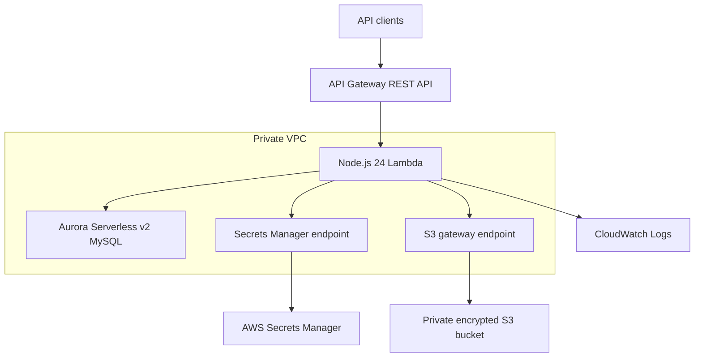
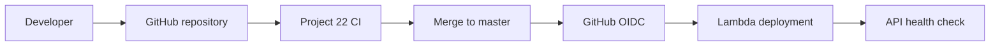

# AWS Serverless API with Terraform and GitHub Actions

A production-style Node.js API deployed on AWS using API Gateway, Lambda, Aurora Serverless v2, S3, Secrets Manager, VPC endpoints, CloudWatch, Terraform, and GitHub Actions.

This implementation modernizes the original Project 22 application for Node.js 24, AWS SDK v3, Aurora Serverless v2, secure GitHub OIDC deployment, private networking, and binary image uploads.

## Architecture



The Lambda function runs in two private subnets across separate Availability Zones. It does not require a NAT gateway because database access stays inside the VPC and AWS service access uses VPC endpoints.

## Deployed configuration

| Component | Configuration |
|---|---|
| AWS Region | `ap-south-1` |
| API stage | `dev` |
| Lambda | Node.js 24, 512 MiB, 30-second timeout |
| Database | Aurora MySQL `8.0.mysql_aurora.3.12.0` |
| Aurora capacity | 0–1 ACU with automatic pause |
| Networking | Two private subnets in separate Availability Zones |
| S3 | Private access, AES-256 encryption, public access blocked |
| Secrets | RDS-managed credentials in Secrets Manager |
| API uploads | `multipart/form-data` configured as binary media |
| Monitoring | CloudWatch Lambda logs |
| Infrastructure | Terraform |
| CI/CD identity | GitHub Actions OIDC with short-lived AWS credentials |

The default API Gateway HTTPS URL is exposed through Terraform output. A custom Route 53 domain and ACM certificate are optional and disabled by default.

## Security

- Lambda, Aurora, and interface endpoints use dedicated security groups.
- Aurora accepts database traffic only from the Lambda security group.
- Lambda retrieves database credentials from Secrets Manager.
- Secrets Manager is accessed through a private interface endpoint.
- S3 is accessed through a private gateway endpoint.
- The S3 bucket blocks public access and encrypts stored objects.
- Aurora and its managed secret use AWS KMS encryption.
- GitHub Actions uses OIDC instead of permanent AWS access keys.
- The deployment role trusts only the `master` branch of this repository.
- The deployment role can update only the Project 22 Lambda function.
- JSON request and file-upload sizes are limited.
- Production npm dependencies report zero known vulnerabilities at validation time.

## Prerequisites

- Terraform `>= 1.10.0, < 2.0.0`
- AWS CLI v2
- Node.js 24 and npm
- Git
- An AWS CLI profile with provisioning permissions

Authenticate locally:

```bash
export AWS_PROFILE="devops-admin"
export AWS_REGION="ap-south-1"
export AWS_DEFAULT_REGION="ap-south-1"
export AWS_PAGER=""

aws sso login --profile "$AWS_PROFILE"
aws sts get-caller-identity
```

## Terraform variables

| Variable | Default | Purpose |
|---|---:|---|
| `region` | `ap-south-1` | AWS Region |
| `aws_profile` | `devops-admin` | Local AWS CLI profile |
| `cidr_block` | `10.22.0.0/16` | Application VPC CIDR |
| `private_subnets` | `2` | Private subnet count |
| `database` | `webapp` | Initial database name |
| `aurora_engine_version` | `8.0.mysql_aurora.3.12.0` | Aurora MySQL version |
| `api_stage` | `dev` | API stage and name suffix |
| `lambda_memory_size` | `512` | Lambda memory in MiB |
| `enable_custom_domain` | `false` | Enable ACM and Route 53 integration |
| `domain` | empty | Custom API hostname |
| `hosted_zone_name` | empty | Route 53 public hosted zone |

Override defaults through a `.tfvars` file or `-var` arguments. Do not commit credentials or sensitive values.

## Deploying the infrastructure

```bash
terraform init
terraform fmt -check -recursive
terraform validate
terraform plan -out=project22.tfplan
terraform apply project22.tfplan
```

Display deployment information:

```bash
terraform output
terraform output -raw api_invoke_url
terraform output -raw healthcheck_url
terraform output -raw lambda_function_name
terraform output -raw artifact_bucket_name
```

Check for drift:

```bash
terraform plan -detailed-exitcode
```

Exit code `0` means no drift, `2` means changes are present, and `1` means the plan failed.

## Running locally

```bash
cd serverless-api
npm ci
npm audit --omit=dev
node --check index.js
find api -type f -name '*.js' -print0 | xargs -0 -r -n1 node --check
npm start
```

The local health endpoint is `http://127.0.0.1:3000/healthz`. Database-backed routes require the expected database and Secrets Manager environment variables. The health endpoint is intentionally independent of database initialization.

## API endpoints

Set the deployed base URL:

```bash
API_URL="$(terraform output -raw api_invoke_url)"
```

| Method | Endpoint | Authentication | Purpose |
|---|---|---|---|
| GET | `/healthz` | Public | Application health |
| POST | `/user` | Public | Create a user |
| GET | `/user/{userId}` | Basic Auth | Retrieve the authenticated user |
| PUT | `/user/{userId}` | Basic Auth | Update the authenticated user |
| GET | `/product/{productId}` | Public | Retrieve product details |
| POST | `/product` | Basic Auth | Create a product |
| PUT | `/product/{productId}` | Owner Basic Auth | Fully update a product |
| PATCH | `/product/{productId}` | Owner Basic Auth | Partially update a product |
| DELETE | `/product/{productId}` | Owner Basic Auth | Delete a product |
| GET | `/product/{productId}/image` | Basic Auth | List product images |
| POST | `/product/{productId}/image` | Owner Basic Auth | Upload an image |
| GET | `/product/{productId}/image/{imageId}` | Basic Auth | Retrieve image metadata |
| DELETE | `/product/{productId}/image/{imageId}` | Owner Basic Auth | Delete image metadata and S3 object |

Protected routes use HTTP Basic Authentication:

```bash
curl --user 'user@example.com:password' "${API_URL}/user/1"
```

## Binary image handling

API Gateway declares `multipart/form-data` as a binary media type. This prevents binary files from being converted to UTF-8 text before reaching Lambda.

```bash
curl --request POST \
  --user 'user@example.com:password' \
  --form 'image=@test.png;type=image/png' \
  "${API_URL}/product/1/image"
```

Uploaded images are stored in the private S3 bucket, while image metadata is stored in Aurora.

## CI/CD



### Continuous integration

`.github/workflows/project22-ci.yml` runs for Project 22 pushes and pull requests. It performs Node.js 24 setup, `npm ci`, a production dependency audit, JavaScript syntax validation, a local health check, Terraform initialization without a backend, Terraform formatting validation, and Terraform configuration validation. CI receives no AWS credentials.

### Continuous deployment

`.github/workflows/project22-deploy.yml` runs when Project 22 application code reaches `master`. It validates and packages the application, requests a GitHub OIDC token, assumes the least-privilege deployment role, updates the Lambda function, waits for the update, and verifies the deployed health endpoint.

The AWS trust policy permits only:

```text
repo:SubhamPanwarr/DevOps-Projects:ref:refs/heads/master
```

No AWS access key or secret key is stored in GitHub.

## Operational verification

```bash
aws lambda get-function-configuration \
  --function-name project22-serverless-api-dev \
  --query '{State:State,Update:LastUpdateStatus,Runtime:Runtime,Memory:MemorySize,Timeout:Timeout}' \
  --output table

aws logs tail \
  /aws/lambda/project22-serverless-api-dev \
  --since 20m \
  --follow

curl --fail --silent --show-error \
  "$(terraform output -raw healthcheck_url)"
```

## Cleanup

Review the destruction plan before applying it:

```bash
terraform plan -destroy -out=project22-destroy.tfplan
terraform show -no-color project22-destroy.tfplan
terraform apply project22-destroy.tfplan
```

Destruction permanently removes the database, stored images, API, Lambda function, IAM deployment role, and GitHub OIDC provider managed by this Terraform state.

## Repository

Project implementation: [SubhamPanwarr/DevOps-Projects](https://github.com/SubhamPanwarr/DevOps-Projects/tree/master/DevOps-Project-22)

This project was modernized from the original educational implementation by [NotHarshhaa](https://github.com/NotHarshhaa/DevOps-Projects/tree/master/DevOps-Project-22).
